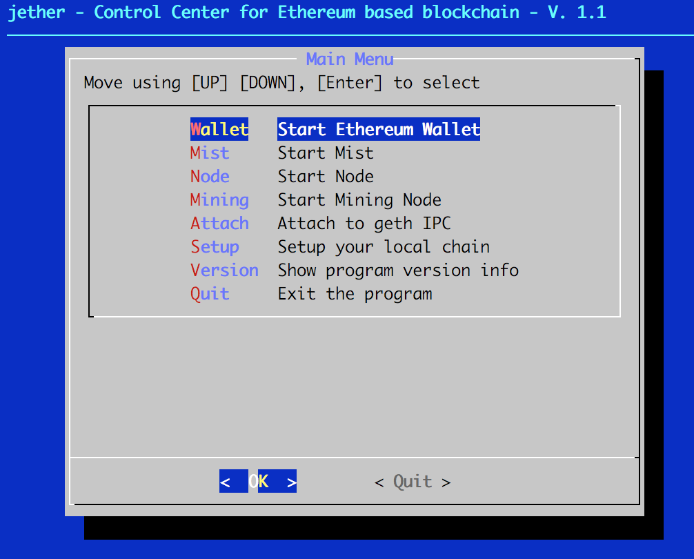
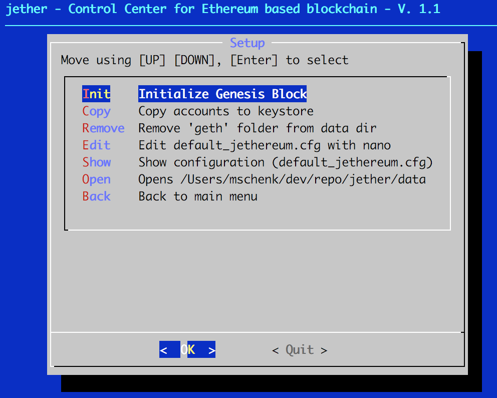

# jether - Control Center for Ethereum based blockchain

jether is a simple dialog tool for a set of shell commands I usually can't remember because these ethereum and geth commands are long as hell and also fail silently. 

jether has two menus. The Main Menu for starting and stopping nodes and applications.

and the Setup Menu, which helps you to initialize and remove & cleanup your own blockchain. Once you have tried to build your own blockchain, you will learn that a clean restart is something you want to do fast.

And this tool is optimized for mac.

## Installation 

### Tools
- dialog (`brew install dialog`   )
- go-ethereum (`brew install ethereum` or [https://github.com/ethereum/go-ethereum/wiki/Installation-Instructions-for-Mac]())

### Applications

- Ethereum Wallet [https://github.com/ethereum/mist/releases]()
- Mist [https://github.com/ethereum/mist/releases]()

## Download current Version:

| zip| tar.gz  | Version  | Date  |
|---|---|:-:|:-:|
|[jether-1.0.zip](https://github.com/Decksname/jether/archive/1.0.zip)|[jether-1.0.tar.gz](https://github.com/Decksname/jether/archive/1.0.tar.gz) | 1.0  | 18. Nov 2017  |
| [jether-1.1.zip](https://github.com/Decksname/jether/archive/1.1.zip)  |[jether-1.1.tar.gz](https://github.com/Decksname/jether/archive/1.1.tar.gz)| 1.1  | 26. Jan 2018  |
| [jether-1.2.zip](https://github.com/Decksname/jether/archive/1.2.zip)  |[jether-1.2.tar.gz](https://github.com/Decksname/jether/archive/1.2.tar.gz)| 1.2  | 26. Jan 2018  |

## Setup

This tool has two configuration files:

- **default_jethereum.cfg**: contains gobal configuration for accessing the blockchain.
- **personal_jethereum.cfg**: contains your personal settings, make sure to adjust them to your needs and local settings

#### Configuration Parameters

| Parameter  | Desription  |
|---|---|
| DATADIR  | This path to your data directory. The place where you want to store your blockchain  | 
| IPC | Path to the IPC (Inter-process Communications) pipe of your node. This is needed to connect other tools like Mist to your node.   Usually it's /geth.ipc in your datadir| 
| ACCOUNT   | The account you want to mine with.  |   
| THREADSFORMINING | The number of threads you want to use for mining. |
|OWNPORT | For your own port you can use any port **EXCEPT** 30303 or 30304|
|APP_ETHEREUMWALLET| Path to your Ethereum Wallet application. This will be the same on most mac systems. It is required to start the application and make it connect to your private network and not the mainnet |
|APP_MIST|Path to your Ethereum Wallet application. This will be the same on most mac systems. It is required to start the application and make it connect to your private network and not the mainnet|

## Run

`./jether.sh`

## Open Topics

- automatic delete an reste